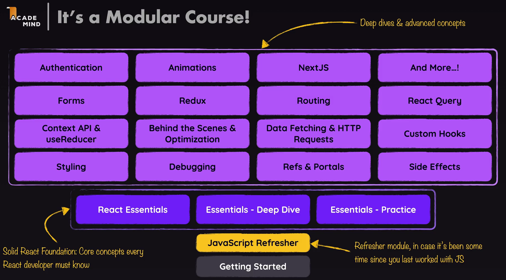

# 01. What is React [ 27/10/2025 ]

---

## What is React ?

- React is a JS Library for building UI [ User Interfaces ]

## Why would you Use React ?

- React helps us to build better, smoother & Responsive UI’s & UX’s for web
    - i.e., Transitions are Smooth & Very Responsive with Instant Feedback
- React helps us to build SPA → No page Loads.

## How are these possible ?

- React uses JS [ in the Browser ] to update the Webpage without Reloading [ the Webpage ] → SPA
- JS can do this as it was able to read & Manipulate the Webpage after it was loaded
- So when we hit a button [ like movies tab on Netflix ],
    - It fetches the movie’s data behind the scenes [ in the background ] without Reloading/Leaving the page
    - and then it Updates the page on the Screen with that Movie’s data
    - Hence, It leads to smooth Transition between those pages

## But as JS can do all these, then Why we need React ?

- Yes, we can do all using JS alone
- But, It isn’t a Great Option
    - Using JS alone to build Complex UI’s or App’s can be:
        - more work → More DOM manipulations, Event Handling
        - more code → Hard to Maintain & Debug
        - more Error-Prone
- Hence we go for JS libraries like React, when Building Complex UI’s & App’s

<aside>
💡

Code Sandbox

- Code Sandbox is a In-browser, cloud based code Editor/IDE
- It helps to work on Projects without Installing any software’s or tools on our Local System
    - i.e., User System Independent & Platform Independent
</aside>

## Key Features of React

1. **Component-Based**
    - Build UIs using **reusable components** that manage their own state.
2. **Declarative**
    - Define **what** the UI should look like && React updates it efficiently.
3. **Virtual DOM**
    - Uses a lightweight, in-memory DOM to update only what's needed — Making it fast
4. **One-Way Data Flow [ Binding ]**
    - Data flows **one direction [ parent → child ]**, making apps predictable and easier to debug.
5. **JSX**
    - A Syntax to Write **HTML-like code** directly in JavaScript [ for cleaner UI code ]

## Declarative UI Programming [ Approach ]

- `Declarative Approach/Way` → Defines the Target/Goal, but NOT the Steps required to get there
    - We just Define what is the Target But NOT How to Reach the Target [ It will be Done Automatically ]
- React Follows Declarative Approach
    - i.e., Just Declare the UI, React will do it.
    - In React, We define the Final State of the UI, React will figure out the necessary Steps, performs those Steps & Update the UI Efficiently
        - i.e., We will Just define the Target UI, & when to change the UI
        - React will take care of the rest
            - How ..?
            - React uses JS to Apply those Changes Efficiently in the best way possible
- JS Follows Imperative Approach
    - In JS, we need to define all the steps in a step-by-step manner [ in order to Define the UI ]
    - In doing so, we may miss one or few steps & leads to Error

## Course Outline

